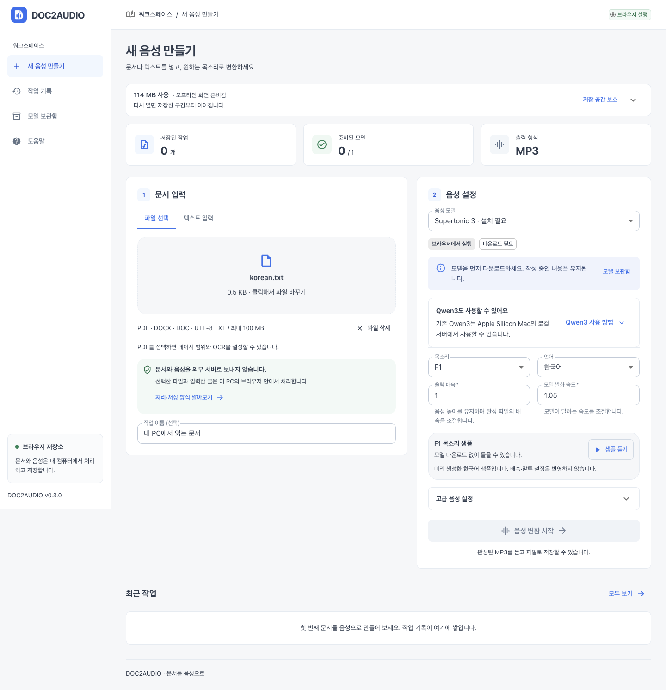

# 사용법

DOC2AUDIO는 PDF·Word·TXT 문서를 내 PC에서 음성으로 만들어 MP3로 저장합니다. 배포된 사이트는 브라우저에서 바로 사용하고, Qwen3가 필요하면 Apple Silicon Mac에 [로컬 프로그램을 설치](installation.md)하세요.

- [웹에서 문서 변환](#웹에서-문서-변환)
- [문서와 음성 설정](#문서와-음성-설정)
- [Qwen3 로컬 웹 사용](#qwen3-로컬-웹-사용)
- [터미널에서 변환](#터미널에서-변환)
- [저장 위치와 삭제](#저장-위치와-삭제)
- [중단·이어하기·오프라인](#중단이어하기오프라인)
- [문제 해결](#문제-해결)

## 웹에서 문서 변환

1. 사이트의 **새 음성 만들기**에서 파일을 선택하거나 **텍스트 입력**에 본문을 붙여 넣습니다.
2. **모델 보관함**에서 Supertonic 3을 다운로드합니다. 약 401 MB를 이 PC의 브라우저에 저장하며 다음부터 재사용합니다. 메뉴를 이동해도 작성 중인 내용은 유지됩니다.
3. **새 음성 만들기**로 돌아와 목소리를 고르고 **샘플 듣기**로 비교합니다. 처음에는 한국어·F1과 나머지 기본 설정으로 시작하세요.
4. **음성 변환 시작**을 누르고 **작업 기록**에서 진행 상황을 확인합니다.
5. 완료된 작업을 열어 음성을 듣고 **MP3 저장**을 누릅니다. 다운로드 폴더 또는 브라우저에서 선택한 위치에 일반 파일로 저장됩니다.

**샘플 듣기**에는 모델 다운로드가 필요 없습니다. 미리 만든 한국어 음성이므로 현재 배속·말투 설정은 샘플에 반영되지 않습니다.



**파일 선택은 외부 서버 업로드가 아닙니다.** 기본 웹 모드에서는 문서 읽기·글자 추출·OCR·음성 생성·MP3 저장을 모두 내 PC의 브라우저에서 처리합니다. 인터넷은 웹 실행 파일과 공개 모델을 처음 내려받는 데 사용합니다.

선택한 문서와 설정은 **변환 시작 후 작업 등록이 끝나야** 저장됩니다. 등록 전 선택한 파일이나 입력 중인 글은 창을 닫거나 새로고침하면 사라집니다.

## 문서와 음성 설정

웹 화면은 파일당 100 MB, 직접 입력은 백만 글자까지 받습니다. 원본 문서 파일은 변경하지 않습니다.

| 입력     | 사용 방법과 제한                                                                                                   |
| -------- | ------------------------------------------------------------------------------------------------------------------ |
| PDF      | 필요한 페이지만 읽으려면 페이지 범위에 `1-3,5` 입력. 인쇄된 쪽 번호가 아닌 PDF 파일의 페이지 순서입니다.           |
| 스캔 PDF | **스캔 문서 OCR**을 자동 또는 항상으로 설정합니다. 한국어·영어를 인식하며 숫자·이름·복잡한 표는 확인이 필요합니다. |
| DOCX     | 본문과 표를 읽습니다. 이미지 속 글자와 일부 머리말·각주·도형은 빠질 수 있습니다.                                   |
| DOC      | Word 97 이후의 바이너리 DOC를 지원합니다. 열리지 않으면 DOCX 또는 PDF로 다시 저장하세요.                           |
| TXT      | UTF-8로 저장한 일반 텍스트를 사용합니다.                                                                           |

OCR **자동**은 텍스트가 깨졌거나 스캔으로 판단한 페이지를 인식합니다. **항상**은 선택한 모든 페이지를 이미지로 읽고, **사용 안 함**은 기존 텍스트만 추출합니다. 이미지 속 글자가 빠지면 항상으로 바꾸세요. 암호가 걸린 문서는 암호를 해제한 사본을 사용합니다.

일상적으로는 목소리와 출력 배속만 조절하면 됩니다. 모델마다 지원하는 설정만 화면에 표시합니다.

| 설정              | 범위와 용도                                                                                          |
| ----------------- | ---------------------------------------------------------------------------------------------------- |
| 목소리            | Supertonic은 F1–F5·M1–M5, Qwen3는 Sohee 등 9개. 한국어 기본값은 각각 F1·Sohee입니다.                 |
| 언어              | 본문에 맞춰 선택합니다. 기본값은 한국어이며 Qwen3는 자동 감지도 지원합니다.                          |
| 출력 배속         | 0.5~2배, 기본 1배. 음높이를 유지하면서 완성 파일의 속도를 바꿉니다.                                  |
| 모델 발화 속도    | Supertonic만 지원. 0.7~2배, 기본 1배. 음성을 생성할 때 읽는 속도이며 출력 배속과 함께 적용됩니다.    |
| 음성 생성 단계    | Supertonic만 지원. 2~30회, 기본 8회. 높이면 음성 생성에 걸리는 시간이 늘어납니다.                    |
| 말투 지시         | Qwen3 1.7B만 지원. 예: `차분하고 또렷하게 읽어 주세요.`                                              |
| 표현 다양성       | Qwen3만 지원. 0.1~1.5, 기본 0.7. 높이면 음성 생성 시 선택의 다양성이 커집니다.                       |
| 음성 토큰 후보 수 | Qwen3의 Top-K. 0~1000, 기본 50. 작을수록 생성 후보를 좁히며 0이면 후보 수를 제한하지 않습니다.      |
| 샘플링 범위       | Qwen3의 Top-P. 0.1~1, 기본 0.9. 생성 후보를 누적 확률로 제한합니다.                                 |
| 반복 억제         | Qwen3만 지원. 1~2, 기본 1.05. 이미 생성한 음성 토큰의 반복을 억제합니다.                             |
| 구간 사이 쉼      | 고급 설정에서 0~3초, 기본 0.3초. 출력 배속을 적용하기 전의 길이입니다.                               |
| 랜덤 시드         | 0~4294967295, 기본 42. 합성의 무작위 선택을 제어하며 같은 설정으로 재현성을 높입니다.                 |
| 구간 최대 글자 수 | 브라우저는 40–120자, 기본 120자. 로컬 프로그램은 40–600자, 기본 Qwen3 240자·Supertonic 120자입니다.  |

완료 화면의 **듣기 배속**은 재생 중에만 적용됩니다. 저장되는 MP3 속도를 바꾸려면 변환 전 **출력 배속**을 설정하세요.

## Qwen3 로컬 웹 사용

[설치 안내](installation.md)에 따라 로컬 프로그램과 웹 화면을 준비한 뒤 프로젝트 폴더에서 실행합니다.

```bash
uv run doc2audio-server
```

터미널을 켜 둔 채 [Qwen3 로컬 화면](http://127.0.0.1:8010/?runtime=local#new)을 엽니다.

1. **모델 보관함**에서 사용할 모델 하나만 다운로드합니다. 이미 설치한 모델은 재사용합니다.
2. **새 음성 만들기**에서 문서를 선택하고 Qwen3 1.7B 또는 0.6B와 목소리를 고릅니다. 기본값은 Qwen3 1.7B·Sohee입니다.
3. 변환을 시작하고 완료되면 **MP3 저장**을 누릅니다.

이 모드에서는 문서를 **같은 PC의 Python 서버(`127.0.0.1`)에 전달**하고, Qwen3는 Mac의 GPU로 실행합니다. 외부 웹 호스팅 서버로 문서를 보내지 않습니다.

주소의 `?runtime=local`을 생략하면 브라우저 모드가 열립니다. 공개 웹에서 선택한 문서·설정·작업은 로컬 화면으로 자동 이동하지 않으므로 문서를 다시 선택하세요. 서버 종료는 실행 중인 터미널에서 **Ctrl+C**를 누릅니다.

## 터미널에서 변환

명령은 설치한 프로젝트 폴더에서 실행합니다. 파일 경로에 공백이 있을 수 있으므로 따옴표로 감싸세요.

### 기본 변환

```bash
uv run doc2audio "문서.pdf" -o "결과.mp3"
```

기본 모델은 Qwen3 1.7B, 목소리는 Sohee, 언어는 한국어입니다. 설치되지 않은 모델은 최초 변환 때 다운로드합니다. `-o`를 생략하면 입력 문서와 같은 폴더에 같은 이름의 `.mp3`를 만듭니다.

기존 출력 파일은 자동으로 덮어쓰지 않습니다. 파일명을 바꾸거나 교체할 때만 `--overwrite`를 추가하세요. `-o "결과.wav"`로 WAV도 저장할 수 있습니다.

### 목소리·배속·모델 선택

```bash
uv run doc2audio "문서.pdf" -o "결과.mp3" \
  --speaker Sohee --speed 1.2 --pause 0.3 \
  --style "차분하고 또렷하게 읽어 주세요."
```

다른 모델은 `--model`로 선택합니다. 모두 설치할 필요는 없습니다.

```bash
uv run doc2audio "문서.pdf" -o "결과.mp3" --model qwen3-0.6b
```

| 옵션              | 사용할 값                                                                            |
| ----------------- | ------------------------------------------------------------------------------------ |
| `--model`         | `qwen3-1.7b`(기본), `qwen3-0.6b`, `supertonic-3`                                     |
| `--speaker`       | 모델에 등록된 목소리. 한국어 기본값은 Qwen3 `Sohee`, Supertonic `F1`                 |
| `--language`      | Qwen3 한국어는 `Korean`, Supertonic 한국어는 `ko`                                    |
| `--speed`         | 0.5~2.0, 기본 1.0                                                                    |
| `--pause`         | 0~3초, 기본 0.3                                                                      |
| `--style`         | Qwen3 1.7B의 말투 지시. 다른 모델에는 사용하지 않습니다.                             |
| `--chunk-chars`   | 40–600자. 기본 Qwen3 240자·Supertonic 120자                                          |
| `--model-options` | 모델별 추가 설정 JSON. 예: Supertonic의 `'{"total_steps": 8, "speech_speed": 1}'` |

설치 상태·전체 목소리·고급 옵션은 `uv run doc2audio models`, 전체 명령 옵션은 `uv run doc2audio convert --help`로 확인합니다.

### 본문 확인과 PDF 페이지·OCR 선택

음성 생성 전에 본문만 추출할 수 있습니다. 이 명령은 TTS 모델이 필요 없습니다.

```bash
uv run doc2audio extract "문서.pdf" --pages "1-3,5" --ocr auto -o "본문.txt"
```

추출한 글의 순서·숫자·이름을 확인하고 필요하면 수정한 TXT를 변환하세요.

```bash
uv run doc2audio "본문.txt" -o "결과.mp3"
```

`--pages`와 `--ocr`은 변환 명령에도 그대로 사용할 수 있습니다. OCR은 `auto`(기본), `always`, `never` 중 하나입니다. 이미지 속 글자를 모두 읽으려면 `--ocr always`를 사용합니다.

특정 단어의 발음을 바꾸려면 UTF-8 파일 `발음.json`에 `{"AI": "에이아이"}`처럼 적고 변환 또는 추출 명령에 `--pronunciations "발음.json"`을 추가하세요. 원본 파일은 바꾸지 않고 읽을 본문만 치환합니다.

## 저장 위치와 삭제

| 실행 방식    | 모델 저장 위치                              | 문서·작업·음성 저장 위치                                                       |
| ------------ | ------------------------------------------- | ------------------------------------------------------------------------------ |
| 기본 웹      | 내 PC의 사이트별 브라우저 저장소(IndexedDB) | 같은 저장소. **MP3 저장**으로 내려받은 파일은 별도 보관                        |
| 로컬 웹 서버 | 프로젝트의 `.models/`                       | 프로젝트의 `.doc2audio/jobs.sqlite3`(기록), `.doc2audio/jobs/`(원문·음성)      |
| CLI          | 프로젝트의 `.models/`                       | MP3는 `-o` 지정 위치. 추출 본문과 이어하기 음성은 출력 폴더 아래 `.doc2audio/` |

브라우저 저장소도 내 PC 디스크를 사용하지만, 현재 웹 앱에서 일반 폴더 경로를 지정할 수는 없습니다. 같은 사이트 주소와 브라우저 프로필에서 재사용하며 다른 PC·브라우저로 동기화되지 않습니다. 주소의 도메인·포트·HTTP/HTTPS가 달라지면 별도 보관함을 사용합니다.

### 모델 저장 위치 확인과 삭제

**모델 보관함 → 저장 위치**에서 현재 저장 용량과 모델 위치를 확인하고 복사할 수 있습니다.

- **기본 웹:** `사이트 주소 → IndexedDB → doc2audio-browser → assets / assetParts → 모델 ID`를 표시합니다. 브라우저가 관리하는 내부 위치이며, 디스크의 실제 절대 경로는 웹사이트에서 확인할 수 없습니다.
- **로컬 웹 서버:** 현재 설정이 적용된 모델별 실제 절대 폴더 경로를 표시합니다. 기본 모델인 Qwen3 1.7B는 `.models/qwen3-tts-1.7b-8bit/`에 있습니다.

**모델 삭제**를 누르고 확인하면 선택한 모델의 파일과 중단된 다운로드 조각을 삭제합니다. 기본 웹에서는 해당 모델의 이전 버전 파일도 함께 정리합니다. **문서·작업 기록·중간 음성·완성된 MP3는 보존**합니다. 모델을 사용하는 다운로드·변환 작업이 진행 또는 대기 중이면 먼저 작업을 멈춰야 합니다. 모델 파일만 일부 받은 상태에서도 삭제할 수 있습니다.

삭제 후 새 음성을 만들거나 중단된 변환을 이어가려면 모델을 다시 다운로드하세요. 이미 완성된 MP3는 모델 없이도 듣고 저장할 수 있습니다. 로컬 모델 폴더에 별도로 넣은 파일이나 심볼릭 링크가 있으면 다른 데이터를 보호하기 위해 삭제가 제한될 수 있습니다.

### 로컬 모델과 작업 폴더 지정

CLI와 로컬 웹에서 함께 사용할 모델 폴더는 **다운로드 전에** 다음과 같이 지정하세요. 설정은 같은 터미널에서 실행하는 명령에 적용됩니다.

```bash
export DOC2AUDIO_MODELS_DIR="$HOME/Documents/doc2audio-data/models"
export DOC2AUDIO_DATA_DIR="$HOME/Documents/doc2audio-data/server"
uv run doc2audio download
```

Qwen3 1.7B는 지정한 모델 폴더 아래 `qwen3-tts-1.7b-8bit/`에 저장됩니다. 서버 작업은 지정한 서버 폴더에 저장됩니다. 새 터미널에서는 `export` 두 줄을 다시 실행하고, 이미 켜진 서버는 새 설정으로 다시 시작하세요.

CLI의 출력·이어하기 폴더는 별도로 지정합니다.

```bash
uv run doc2audio "문서.pdf" \
  -o "$HOME/Documents/doc2audio-data/결과.mp3" \
  --work-dir "$HOME/Documents/doc2audio-data/cli-work"
```

경로를 바꿔도 기존 모델·작업은 자동 이동하지 않습니다. 기존 모델을 재사용하려면 원래 모델 루트를 지정하세요. CLI의 `--model-dir`은 공통 루트가 아닌 **모델 한 개의 파일 폴더 자체**를 지정하는 옵션이므로, 위 환경변수 방식과 혼동하지 마세요.

### 데이터 삭제

- **브라우저 작업 삭제:** 진행 중인 작업은 먼저 일시정지하거나 취소한 다음 **작업 삭제**를 누릅니다. 완료·실패한 작업은 바로 삭제할 수 있습니다. 해당 원문·중간 음성·완성 MP3·기록을 삭제합니다.
- **브라우저 전체 초기화:** 브라우저 설정에서 해당 사이트의 쿠키·사이트 데이터를 삭제하면 모델과 모든 작업을 잃을 수 있습니다. 캐시된 이미지·파일만 삭제하는 것은 IndexedDB 삭제와 별개입니다.
- **로컬 파일 정리:** 변환과 서버를 종료한 뒤 필요 없는 모델 폴더나 CLI 이어하기 폴더를 삭제할 수 있습니다. 로컬 서버는 개별 작업 삭제 UI가 없으며, 전체 작업을 초기화하려면 필요한 MP3를 보관한 뒤 서버 데이터 폴더를 삭제합니다.

필요한 MP3는 먼저 일반 파일로 저장하세요. 브라우저의 **저장 공간 보호**는 자동 정리를 줄이기 위한 요청이며 사용자의 사이트 데이터 삭제를 막지는 않습니다. 시크릿 모드나 저장 공간 부족으로 브라우저 데이터가 사라질 수 있습니다. 브라우저 데이터를 지워도 일반 폴더의 로컬 모델과 다운로드한 MP3는 남습니다.

## 중단·이어하기·오프라인

| 실행 방식    | 중단되는 때                    | 이어하는 방법                                                                                        |
| ------------ | ------------------------------ | ---------------------------------------------------------------------------------------------------- |
| 기본 웹      | 탭·브라우저 종료, 새로고침     | 같은 사이트·브라우저 프로필에서 다시 열면 진행·대기 중 작업을 자동 재개합니다.                       |
| 로컬 웹 서버 | Python 서버 종료               | 서버를 다시 켜고 중단된 작업에서 **다시 시도**를 누릅니다. 브라우저만 닫으면 서버는 계속 처리합니다. |
| CLI          | Ctrl+C 또는 실행 프로세스 종료 | 원문과 이어하기 폴더를 보관하고 같은 명령을 다시 실행합니다.                                         |

완료한 구간은 재사용하고 생성 중이던 구간은 다시 만들 수 있습니다. 웹에서 **일시정지**하거나 취소·실패한 작업은 자동으로 시작하지 않으며 **이어서 실행**을 눌러야 합니다. 컴퓨터의 잠자기·전원 종료 중에는 계산이 계속되지 않습니다.

CLI는 같은 본문·모델·음성 설정의 완료 구간을 재사용합니다. 설정을 바꾸면 새로 생성할 수 있습니다. 브라우저 작업을 로컬 서버나 CLI로 옮겨 이어받는 기능은 없습니다.

오프라인으로 쓸 때는 먼저 아래 준비를 마치세요.

- **기본 웹:** 인터넷이 연결된 상태에서 화면의 **오프라인 화면 준비됨** 표시와 모델 다운로드 완료를 확인합니다.
- **로컬 웹·CLI:** 프로그램 설치와 필요한 모델 다운로드를 끝냅니다. 로컬 웹은 웹 화면 빌드도 필요합니다.

다음 명령은 패키지와 모델의 추가 다운로드 없이 실행합니다. 앞의 `uv run --offline`은 패키지 네트워크 접근을, 뒤의 `doc2audio ... --offline`은 모델 다운로드를 막습니다. 필요한 패키지나 모델이 없거나 불완전하면 다운로드 대신 오류로 알립니다.

```bash
uv run --offline doc2audio "문서.pdf" -o "결과.mp3" --offline
```

## 문제 해결

| 증상                                             | 확인·조치                                                                                                                                                                                                                |
| ------------------------------------------------ | ------------------------------------------------------------------------------------------------------------------------------------------------------------------------------------------------------------------------ |
| 웹 변환 버튼이 비활성화됨                        | 파일이나 본문을 입력하고 선택한 모델의 다운로드 완료를 확인하세요.                                                                                                                                                       |
| 모델 다운로드 실패·파일 검증 오류                | 인터넷 연결과 저장 공간을 확인한 뒤 모델 보관함에서 재시도하세요. CLI의 기본 Qwen3는 `uv run doc2audio doctor`로 점검 후 `uv run doc2audio download`를 실행합니다. 다른 모델은 두 명령에 같은 `--model` 값을 지정하세요. |
| 브라우저 저장소를 사용할 수 없거나 용량이 부족함 | 일반 창에서 사이트 저장을 허용하고 디스크 공간을 확보하세요. 필요한 MP3를 저장한 뒤 불필요한 작업을 삭제합니다.                                                                                                          |
| 글자가 없거나 잘못 읽힘                          | 스캔 PDF는 OCR을 항상으로, TXT는 UTF-8로 저장하세요. DOC는 DOCX/PDF로 다시 저장하고, 읽는 순서는 CLI `extract`로 확인합니다.                                                                                             |
| Qwen3 화면이 안 열리거나 Qwen3가 안 보임         | 로컬 서버가 켜져 있는지 확인하고 `http://127.0.0.1:8010/?runtime=local#new`를 여세요. 화면 대신 빌드 안내가 나오면 [설치 안내](installation.md)를 따라 웹 화면을 준비합니다.                                             |
| 로컬 실행에서 ffmpeg·Metal 오류                  | `uv run doc2audio doctor`로 점검하세요. ffmpeg는 `brew install ffmpeg`로 설치하고 서버를 다시 켭니다. Qwen3는 Apple Silicon Mac이 필요합니다.                                                                            |
| 출력 파일이 이미 있거나 이어하기가 안 됨         | 교체하려면 `--overwrite`, 보존하려면 새 출력명을 사용하세요. 이어할 때는 원문·모델·설정과 `--work-dir` 또는 출력 폴더를 유지합니다.                                                                                      |

[설치 안내](installation.md) · [처음으로](../README.md)
