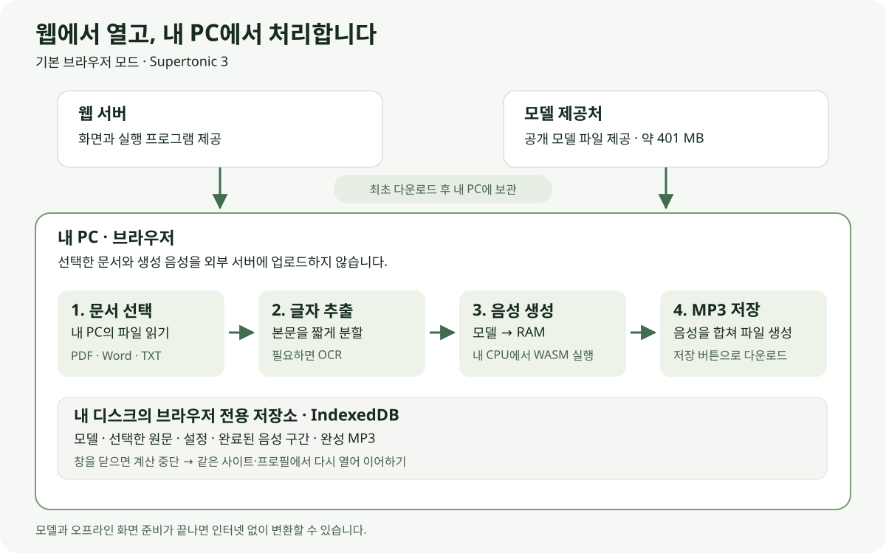

# 웹 사용 안내

기본 웹 모드는 문서 읽기, OCR, 음성 생성, MP3 인코딩을 사용자 PC의 브라우저에서 처리합니다. 문서와 생성 음성을 변환 서버에 업로드하지 않습니다. 웹사이트 이용자는 Python이나 별도 프로그램을 설치하지 않아도 됩니다.

사이트의 **도움말** 메뉴에서도 처리 과정과 저장 위치를 확인할 수 있습니다. 이 문서는 공개 HTTPS 사이트에 접속하는 일반 이용자를 기준으로 설명합니다. 내 PC의 실행 프로그램을 쓰는 Qwen3 방식은 [로컬 사용 안내](local-usage.md)에서 구분해 설명합니다.

## 파일 선택은 서버 업로드인가요?

**기본 웹 모드에서는 아닙니다.** 브라우저가 선택한 파일을 내 PC에서 읽고 처리합니다. 문서·추출한 글·생성 음성을 외부 서버로 전송하지 않으며, 인터넷 연결은 웹 프로그램과 공개 모델 파일을 내려받는 데 사용합니다.



| 순서 | 화면에서 하는 일 | 내부 동작과 실제 위치 |
| --- | --- | --- |
| 1 | 사이트 접속 | 웹서버에서 화면과 실행 파일을 받아 내 PC의 브라우저 캐시에 저장 |
| 2 | 모델 다운로드 | 모델 제공처에서 약 401 MB를 내려받고 버전·파일 검증 후 내 PC의 IndexedDB에 저장 |
| 3 | 문서 선택 후 변환 시작 | 원문·설정을 IndexedDB에 저장해 작업 등록. 그 뒤 내 브라우저에서 글자 추출·분할·OCR 처리 |
| 4 | 음성 생성 | 저장된 모델을 내 PC의 RAM으로 불러오고, WASM 실행 엔진이 CPU로 음성을 생성 |
| 5 | 진행 확인 | 완료한 음성 구간과 작업 정보를 IndexedDB에 계속 저장 |
| 6 | MP3 저장 | 브라우저에서 음성을 합쳐 MP3를 생성. 저장 버튼을 누르면 일반 파일로 다운로드 |
| 7 | 창을 닫았다가 다시 접속 | 닫힌 동안은 중단. 같은 사이트·브라우저 프로필에서 저장한 원문과 완료 구간으로 이어서 처리 |

IndexedDB는 브라우저가 관리하는 **내 PC 디스크의 사이트별 저장소**입니다. 현재 앱에서는 Finder나 탐색기의 특정 모델 폴더를 지정할 수 없습니다. 일반 폴더 지정과 브라우저별 지원 범위는 [모델 저장 위치 안내](model-storage.md)를 참고하세요.


## 접속과 모델 준비

배포된 HTTPS 웹사이트를 같은 브라우저에서 엽니다. 일반 이용자는 개발 도구나 Python을 설치할 필요가 없습니다.

**모델 보관함**에서 Supertonic 3의 용량·출처·OpenRAIL-M 사용 조건을 확인하고 다운로드합니다. 약 401 MB의 모델 파일을 이 브라우저에 저장하며, 완료한 파일과 다운로드 구간은 중단 후 재사용합니다. 실패하면 모델 보관함에 표시된 오류를 확인하고 다시 시도하세요.

현재 이 프로젝트의 브라우저 모드는 Supertonic 3을 지원합니다. 기존 Qwen3 1.7B·0.6B와 한국어 목소리 Sohee는 [로컬 서버·CLI 모드](#선택적-로컬-서버-모드)에서 계속 사용할 수 있습니다. **새 음성 만들기**의 **Qwen3 사용 방법** 또는 **모델 보관함**의 안내에서 실행 명령과 로컬 화면 링크를 확인하세요. 새 모델을 자동 검색해서 설치하지는 않습니다.

## 문서와 설정

1. **새 음성 만들기**에서 문서를 선택하거나 본문을 직접 입력합니다.
2. 필요하면 제목, PDF 페이지 범위, OCR 설정을 지정합니다.
3. 목소리를 고르고 **샘플 듣기**로 비교한 뒤 언어·음성 설정을 선택하고 변환을 시작합니다.
4. **작업 기록**에서 진행 상황을 확인합니다. 완료 후 MP3를 재생하거나 저장합니다.

**샘플 듣기**는 모델을 다운로드하거나 문서를 등록하지 않아도 동작합니다. Supertonic 10개와 로컬 모드의 Qwen 두 모델 각 9개 화자가 같은 짧은 한국어 문장을 읽습니다. 미리 생성한 샘플이므로 현재 배속·말투 설정은 반영하지 않습니다. 목소리·모델·화면을 바꾸면 재생을 정지하며, 오프라인 화면 준비를 마친 뒤에는 샘플도 오프라인으로 들을 수 있습니다.

문서 파일은 100 MB, 직접 입력은 백만 글자까지 받습니다. **‘음성 변환 시작’을 눌러 작업 등록이 완료되면** 원문과 설정을 브라우저 보관함에 저장하므로 다시 접속할 때 파일을 선택할 필요가 없습니다. **등록 전 선택한 파일이나 입력 중인 글은 창을 닫으면 사라집니다.**

| 입력     | 처리 범위                                                                                                                                                                  |
| -------- | -------------------------------------------------------------------------------------------------------------------------------------------------------------------------- |
| PDF      | 본문 텍스트 추출. 페이지는 `1-3,5`처럼 지정하며 인쇄된 쪽 번호가 아닌 PDF의 순서입니다.                                                                                    |
| 스캔 PDF | OCR 자동 또는 항상 설정으로 한국어·영어를 인식합니다. 숫자·고유명사·표·다단 편집은 결과를 확인하세요.                                                                      |
| DOCX     | 본문과 표를 문서 순서대로 읽습니다. 이미지 속 글자나 일부 머리말·각주·도형은 포함되지 않을 수 있습니다.                                                                    |
| DOC      | Word 97 이후의 실제 바이너리 DOC 본문·표 텍스트를 읽습니다. 오래된 다른 형식이나 암호화된 문서는 DOCX·PDF 사본이 필요합니다. 각주·도형·변경 추적 서식은 반영하지 않습니다. |
| TXT      | UTF-8 일반 텍스트. 다른 인코딩은 글자를 임의 대체하지 않고 오류로 알립니다.                                                                                                |

OCR **자동**은 글자가 없거나 스캔으로 판단한 페이지에서 실행합니다. **항상**은 선택한 모든 페이지를 이미지로 읽습니다. **사용 안 함**은 스캔으로 판단한 페이지를 만나면 설정 변경을 안내합니다. 암호가 있는 PDF·DOC는 암호를 해제한 사본을 사용하세요.

| 설정              | 범위와 의미                                         |
| ----------------- | --------------------------------------------------- |
| 목소리            | F1–F5, M1–M5. 기본 F1                               |
| 언어              | 한국어 기본, 총 31개 언어                           |
| 음성 생성 단계    | 2~30, 기본 8. 단계를 늘리면 생성 시간이 늘어납니다. |
| 모델 발화 속도    | 0.7~2배, 기본 1.05. 합성 단계의 읽는 속도           |
| 출력 배속         | 0.5~2배. 음높이를 유지하며 MP3 길이를 조절          |
| 구간 사이 쉼      | 0~3초. 출력 배속 적용 전 값                         |
| 랜덤 시드         | 0~4294967295 정수                                   |
| 구간 최대 글자 수 | 40~120, 기본 120. 구간마다 완료 상태를 저장         |

모델 발화 속도와 출력 배속은 함께 적용됩니다. 플레이어의 **듣기 배속**은 재생할 때만 적용하며 저장한 MP3를 다시 만들지 않습니다.

## 창을 닫았다가 이어하기

브라우저를 닫거나 컴퓨터를 끄면 계산은 멈춥니다. 저장 완료된 음성 구간은 남으며, **같은 사이트를 같은 브라우저 프로필에서 다시 열면 진행 중·대기 중 작업을 자동으로 이어갑니다.** 닫는 순간 생성하던 구간은 다시 생성할 수 있습니다. 문서 추출 도중이었다면 저장한 원문에서 추출을 다시 시작하고, MP3 결합 중이었다면 생성한 구간을 재사용해 결합합니다.

- **일시정지**: 저장한 구간을 유지하고 기다립니다. 다시 접속해도 사용자가 이어하기를 누르기 전에는 시작하지 않습니다.
- **취소**: 처리를 멈춥니다. 기록과 완료 구간은 남아 다시 시도할 수 있습니다.
- **실패**: 오류 원인을 해결한 뒤 다시 시도합니다. 검증된 완료 구간은 재사용합니다.
- **삭제**: 해당 작업의 원문·중간 음성·완성 MP3·기록을 브라우저에서 지웁니다. 필요하면 먼저 MP3를 저장하세요.

같은 사이트를 여러 탭으로 열어도 한 탭에서 순서대로 처리합니다. 완료된 작업을 다시 접속했다는 이유로 재생성하지 않습니다. PWA로 설치해도 브라우저가 종료된 동안 계산을 계속하는 것은 보장하지 않습니다.

## 보관함과 오프라인 사용

화면에서 오프라인 준비 완료 상태를 확인하고 모델 다운로드를 마친 뒤 인터넷 없이 사용할 수 있습니다. 화면과 문서·OCR·음성 실행 파일은 서비스 워커 캐시에, 모델·선택한 원문·작업·중간 음성·완성 MP3는 IndexedDB에 저장합니다. 첫 방문이나 준비가 끝나지 않은 상태에서는 인터넷이 필요합니다. 모델 출처·라이선스의 외부 링크를 열 때도 인터넷이 필요할 수 있습니다.

브라우저의 보관함 유지 요청은 저장 공간의 자동 정리를 줄이기 위한 요청입니다. 브라우저가 허용 여부를 결정하며 거절되어도 일반 저장은 계속 사용합니다. 이 요청은 사용자가 사이트 데이터를 직접 삭제하는 것을 막지 않습니다.

기록은 사이트 주소의 프로토콜·호스트·포트와 브라우저 프로필에 연결됩니다. 예를 들어 `localhost:4173`과 `127.0.0.1:4173`, 개발 주소와 배포 주소는 서로 다른 보관함입니다. 다른 PC나 다른 브라우저로 자동 동기화되지 않습니다. 같은 호스트·포트 안에서 경로만 바꾸면 IndexedDB 저장 영역은 공유하지만, 각 경로의 오프라인 화면 준비는 다시 필요할 수 있습니다.

| 삭제하거나 바꾸는 항목 | 기존 데이터에 미치는 영향 |
| --- | --- |
| 캐시된 이미지·파일만 삭제 | 화면과 실행 파일을 다시 받아야 할 수 있음. IndexedDB의 모델·작업과는 별개 |
| 쿠키·사이트 데이터 삭제 | 해당 사이트의 IndexedDB도 삭제되어 모델·문서·음성·작업 기록을 잃을 수 있음 |
| 다른 도메인·브라우저 프로필로 접속 | 별도의 보관함을 사용하며 기존 보관함이 자동으로 이동하지 않음 |
| 완성 MP3를 일반 파일로 저장 | 사이트 데이터를 지워도 다운로드한 파일은 남음 |

시크릿 모드나 브라우저의 저장 공간 정리로도 기록과 모델이 사라질 수 있습니다. 저장 공간이 부족하면 불필요한 작업을 삭제하거나 디스크 공간을 확보한 뒤 재시도하세요. 완성된 MP3는 일반 파일로 저장하여 별도로 보관할 수 있습니다.

## 선택적 로컬 서버 모드

이 프로젝트에 연결된 Qwen3는 **Apple Silicon Mac의 Python·MLX 실행기**를 사용합니다. Python 3.12, macOS 14 이상, ffmpeg 등 준비 사항과 폴더 지정·CLI 변환 방법은 [로컬 사용 안내](local-usage.md)를 참고하세요. 프로젝트 설치 후 해당 폴더의 터미널에서 실행합니다.

```bash
uv sync --locked
npm ci
npm run build
uv run doc2audio-server
```

설치와 웹 빌드를 마쳤다면 다음부터는 프로젝트 폴더에서 `uv run doc2audio-server`만 실행하면 됩니다. 터미널을 켜 둔 채 **[Qwen3 로컬 화면](http://127.0.0.1:8010/?runtime=local#new)**을 엽니다. 모델 보관함에서 Qwen3 1.7B 또는 0.6B를 준비하고 새 음성 만들기에서 선택하세요. 기존에 설치한 모델 파일은 재사용합니다.

화면의 링크는 사용 중인 컴퓨터의 `127.0.0.1:8010`을 새 탭에서 엽니다. 공개 사이트가 로컬 서버에 자동 접속하거나 현재 문서·설정을 전달하지 않습니다. 연결되지 않으면 서버를 먼저 실행했는지 확인하세요. 새 로컬 화면에서 문서를 다시 선택합니다. `?runtime=local`을 생략하면 기본 브라우저 모드가 열립니다.

로컬 모드에서는 Python 서버가 작업을 실행하고 SQLite·로컬 폴더에 보관하므로 브라우저를 닫아도 서버가 켜져 있는 동안 계속 처리합니다. 서버 종료 후 중단된 작업은 재시도할 수 있습니다. 컴퓨터가 잠자기 상태이면 계산이 진행되지 않을 수 있습니다. 브라우저 보관함과 Python 서버의 보관함은 별개이며, 공개 웹에서 시작한 작업이 로컬 서버로 자동 이전되지는 않습니다.

브라우저 모드에 Qwen3가 없는 것은 현재 연결한 실행기의 범위입니다. [Qwen 공식 예제](https://github.com/QwenLM/Qwen3-TTS#launch-local-web-ui-demo)는 Python 서버를 사용하는 웹 UI를 제공하고, [MLX-Audio](https://github.com/Blaizzy/mlx-audio#quick-start)는 Qwen3의 MLX 모델 실행 방법을 설명합니다. 이 프로젝트의 MLX 가중치를 현재 Supertonic용 브라우저 실행기에 바로 불러오는 기능은 구현되어 있지 않습니다.

공개 웹 배포는 Python 서버 대신 [정적 배포 안내](browser-runtime.md)를 따르세요.

## 개발자가 로컬에서 웹 화면 확인하기

Node.js 22.20 이상(22.x), 24.12 이상(24.x), 또는 26 이상에서 프로젝트 루트 기준으로 실행합니다.

```bash
npm ci
npm run build
npm run preview
```

접속 주소는 `http://127.0.0.1:4173`입니다. 이 단계는 개발·배포 확인용이며 일반 웹사이트 이용자에게 필요한 설치 과정이 아닙니다.
